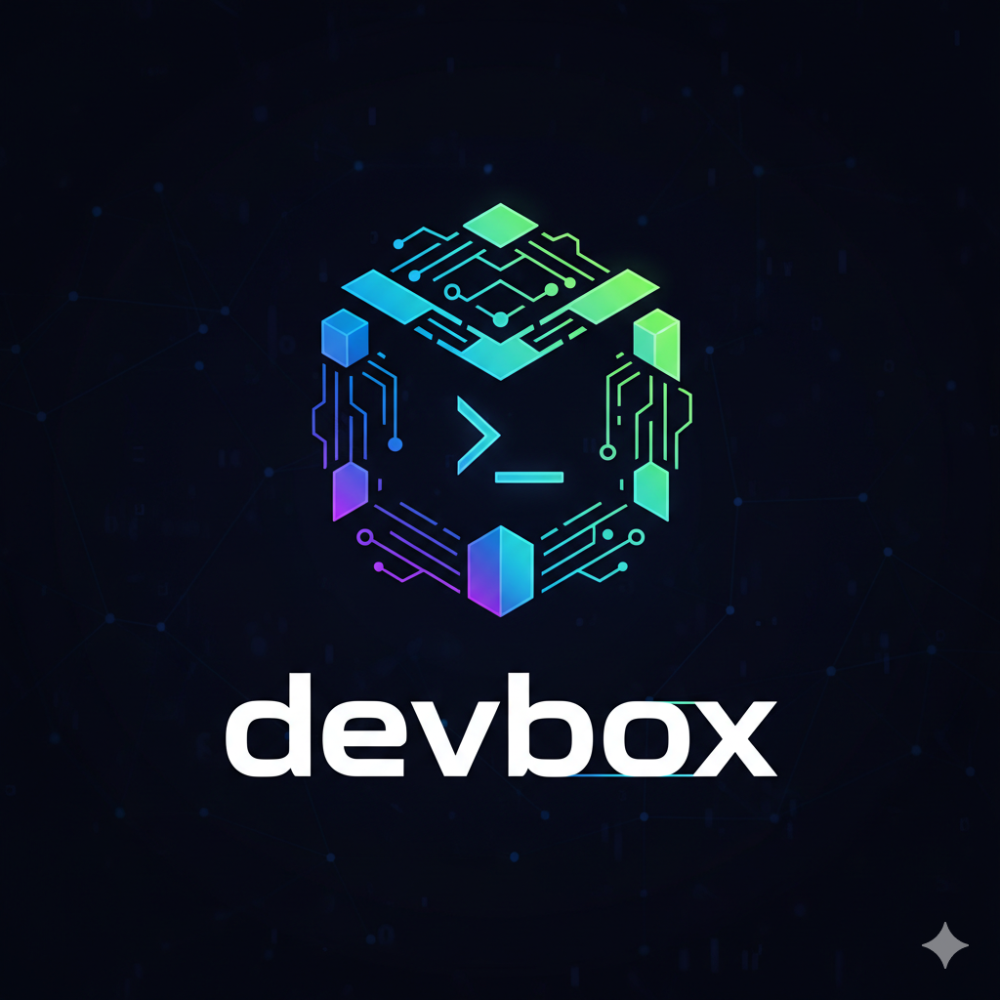

<p align="center">
  
</p>

# Devbox

Devbox is a lightweight Python CLI that helps you build and start a development container from a `devcontainer.json` (VS Code Dev Container–style) located in `.devcontainer/`. It parses mount definitions, builds the image (if requested), and launches a container with deterministic image naming based on your project folder.

## Table of Contents
1. Purpose
2. Features
3. Installation
4. Quick Start
5. `devcontainer.json` Support
6. Mount Specification
7. Deterministic Image Naming
8. CLI Commands
9. Architecture Overview
10. Development Workflow
11. Testing
12. Linting & Formatting
13. Troubleshooting
14. Roadmap / Future Ideas
15. FAQ
16. License / Attribution

---

## 1. Purpose

Provide a minimal, scriptable alternative to full-featured dev container tooling: read a `devcontainer.json`, build an image (if defined), start a container with mounts, and allow easy terminal access.

---

## 2. Features

- Auto-discovery of `.devcontainer/devcontainer.json` by walking up from current directory.
- Deterministic image naming per folder (stable across runs).
- Random container names to allow multiple concurrent instances.
- Parsing of `mounts` and optional `workspaceMount` (string or object forms).
- Reuse of an existing container built from the same image (restart if exited).
- Simple Typer-based CLI (`devbox start`, `devbox stop`, `devbox it`).
- Extensible design for future `features`, environment merging, etc.

---

## 3. Installation

### Prerequisites
- Python ≥ 3.9
- Docker daemon accessible locally
- (Optional) [uv](https://github.com/astral-sh/uv) tool for fast environment management

### Using `make`
```/dev/null/terminal.sh#L1-4
make install   # Installs devbox as an editable package via uv
make sync      # Sync dependencies
```

### Manual (uv)
```/dev/null/terminal.sh#L1-3
uv sync
uv run devbox --help
```

### Manual (pip)
```/dev/null/terminal.sh#L1-3
python -m venv .venv
source .venv/bin/activate
pip install -e .
```

---

## 4. Quick Start

1. Create `.devcontainer/devcontainer.json` in your project root:
```/dev/null/devcontainer.json#L1-10
{
  "build": { "dockerfile": "Dockerfile" },
  "mounts": [
    "source=/Users/you/.aws,target=/root/.aws,type=bind,consistency=cached"
  ]
}
```

2. Run:
```/dev/null/terminal.sh#L1-2
devbox start
```

3. Attach an interactive shell:
```/dev/null/terminal.sh#L1-2
devbox it <container_id>
```

4. Stop container:
```/dev/null/terminal.sh#L1-2
devbox stop <container_id>
```

If you omit `"build"` and specify `"image": "python:3.12-slim"`, Devbox will skip building and start from that existing image.

---

## 5. `devcontainer.json` Support

Currently recognized keys:
- `build.dockerfile` – path relative to `.devcontainer/` (default `Dockerfile`)
- `image` – alternative to `build` section; use existing image instead of building
- `mounts` – array of string or object entries
- `workspaceMount` – optional single mount (string or object)
- `name` – optional explicit container name (else random)

Not yet implemented but planned:
- `features`
- `remoteEnv` / env merging
- `runArgs`
- Lifecycle hooks

---

## 6. Mount Specification

Supported forms inside `mounts` array:

String form:
```
source=/absolute/host/path,target=/container/path,type=bind,consistency=cached,readonly=true
```

Object form:
```/dev/null/mount_example.json#L1-8
{
  "source": "/absolute/host/path",
  "target": "/container/path",
  "type": "bind",
  "read_only": false,
  "consistency": "delegated"
}
```

Rules:
- `type`: `bind` | `volume` | (future: `tmpfs`)
- `readonly=true` or `mode=ro` sets read-only
- Anonymous volumes: `type=volume` without `source=` -> Devbox generates a synthetic volume name
- `workspaceMount` obeys same parsing logic
- Unsupported mount entry types are ignored with a warning

---

## 7. Deterministic Image Naming

When building an image (no custom `"image"` provided), Devbox derives a name:
```
devbox_image_<sanitized-folder-name>_<hash>
```
Where:
- `<sanitized-folder-name>` is lowercase, replacing non-alphanumeric chars with `-`
- `<hash>` is first 8 chars of SHA-256 of full folder path (avoids collisions of same folder name in different locations)

Container names remain random: `devbox_<10-char-random>`.

---

## 8. CLI Commands

Installed via the entry point `devbox = "devbox:main"`.

```/dev/null/help.txt#L1-6
devbox start          # Build or start container according to devcontainer.json
devbox stop <id>      # Stop a running container
devbox it <id>        # Open interactive /bin/bash shell (docker exec)
```

Retrieve a container ID from the output of `devbox start` or via `docker ps`.

---

## 9. Architecture Overview

Core modules:
- `devbox/devcontainer.py`
  - `get_devcontainer_json()` – discovers and loads JSON
  - `generate_random_name()` – deterministic image naming / random container naming
  - `get_mounts()` – orchestrates parsing of mounts
  - `start_dev_container()` – reuse or create container
  - `build_dev_container()` – build image and start container
  - `_parse_mount_string()`, `_parse_mount_dict()` – helpers
- `devbox/utils.py`
  - `find_devcontainer_config_folder()` – upward directory traversal
  - `find_devcontainer_config()` – locates file
  - `read_json_file()` – JSON loader
- `devbox/cli.py`
  - Typer wiring providing `start`, `stop`, `it`

Sequence:
```/dev/null/flow.txt#L1-7
devbox start
  -> get_devcontainer_json
  -> get_mounts
  -> if build: build_dev_container -> start_dev_container
     elif image: start_dev_container
     else: exit (no spec)
```

---

## 10. Development Workflow

Common commands (see `makefile`):
```/dev/null/make_commands.txt#L1-8
make install   # Install (editable) via uv
make sync      # Sync dependencies
make test      # Run pytest suite
make lint      # Ruff lint (requires ruff to be installed manually if not in dependencies)
make format    # Ruff format
```

Note: `ruff` is referenced in the `makefile` but is not declared in `pyproject.toml` dependencies. Install it manually if needed:
```/dev/null/terminal.sh#L1-2
uv add ruff
# or
pip install ruff
```

---

## 11. Testing

Pytest suite located in `src/tests/`:
- Stubs Docker SDK interactions (no real daemon required)
- Validates mount parsing, image/container naming, container lifecycle reuse

Run:
```/dev/null/terminal.sh#L1-2
make test
# or
uv run pytest
```

---

## 12. Linting & Formatting

Ruff (if installed) commands:
```/dev/null/terminal.sh#L1-3
make lint
make format
```

You can also invoke directly:
```/dev/null/terminal.sh#L1-2
uv run ruff check .
uv run ruff format .
```

---

## 13. Troubleshooting

| Problem | Cause | Resolution |
|---------|-------|-----------|
| "devcontainer.json not found." | Missing file | Create `.devcontainer/devcontainer.json` in project root |
| Mount not appearing | Host path incorrect or not absolute | Use absolute paths in `source=` |
| Reused container missing new mounts | Container reuse logic doesn’t re-create | Stop & remove the existing container; run `devbox start` again |
| Image name changes unexpectedly | Working directory changed | Run from consistent project root; deterministic hashing depends on absolute path |
| `docker SDK not available` | Docker package not installed | Install `docker` (already in dependencies) and ensure environment activated |

---

## 14. Roadmap / Future Ideas

- Support `features` section (VS Code dev container extensions)
- Environment variable merging (`remoteEnv`, `containerEnv`)
- Automatic workspace folder mounting if absent
- `devbox list` command to show managed containers
- Optional build cache controls
- Health checks & status command
- JSON schema validation for `devcontainer.json`
- Support for `postCreateCommand` hooks

---

## 15. FAQ

Q: Why deterministic image name but random container name?  
A: Stable image references ease cache reuse; random containers avoid collision when multiple shells or test runs are spawned.

Q: Can I override image name manually?  
A: Add `"image": "your-custom-name:tag"` in `devcontainer.json` to skip deterministic naming.

Q: How do I add more mounts?  
A: Append entries (string or object form) to the `mounts` array; re-run `devbox start` after stopping existing container.

Q: Does Devbox rebuild automatically when Dockerfile changes?  
A: Not yet. Manually run `devbox start` again; you can add logic to check timestamps.

---

## 16. License / Attribution

License not specified yet. Add one (e.g., MIT or Apache 2.0) to clarify usage rights.

Author: Claudio Masolo  
Version: 0.1.0

---

## Appendix: Example Extended `devcontainer.json`

```/dev/null/devcontainer.json#L1-25
{
  "name": "my-service-dev",
  "build": { "dockerfile": "Dockerfile" },
  "mounts": [
    "source=/Users/you/.aws,target=/root/.aws,type=bind,consistency=cached,readonly=true",
    {
      "source": "/Users/you/projects/shared",
      "target": "/workspace/shared",
      "type": "bind",
      "read_only": false
    },
    "source=workspace_cache,target=/cache,type=volume"
  ],
  "workspaceMount": "source=/Users/you/projects/my-service,target=/workspace,type=bind"
}
```

---

## Contributing

1. Fork & clone
2. Create feature branch
3. Add or adjust tests under `src/tests/`
4. Run `make test && make lint`
5. Submit PR with concise description & rationale

---

Feel free to open issues or suggest enhancements related to Dev Container compatibility, additional mount types, or richer CLI flows.

---

## MIT License

Copyright (c) 2024 Claudio Masolo

Permission is hereby granted, free of charge, to any person obtaining a copy
of this software and associated documentation files (the "Software"), to deal
in the Software without restriction, including without limitation the rights
to use, copy, modify, merge, publish, distribute, sublicense, and/or sell
copies of the Software, and to permit persons to whom the Software is
furnished to do so, subject to the following conditions:

The above copyright notice and this permission notice shall be included in
all copies or substantial portions of the Software.

THE SOFTWARE IS PROVIDED "AS IS", WITHOUT WARRANTY OF ANY KIND, EXPRESS OR
IMPLIED, INCLUDING BUT NOT LIMITED TO THE WARRANTIES OF MERCHANTABILITY,
FITNESS FOR A PARTICULAR PURPOSE AND NONINFRINGEMENT. IN NO EVENT SHALL THE
AUTHORS OR COPYRIGHT HOLDERS BE LIABLE FOR ANY CLAIM, DAMAGES OR OTHER
LIABILITY, WHETHER IN AN ACTION OF CONTRACT, TORT OR OTHERWISE, ARISING FROM,
OUT OF OR IN CONNECTION WITH THE SOFTWARE OR THE USE OR OTHER DEALINGS IN
THE SOFTWARE.
